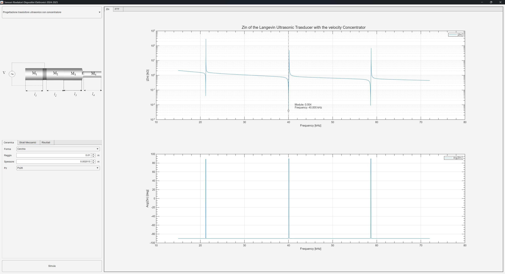
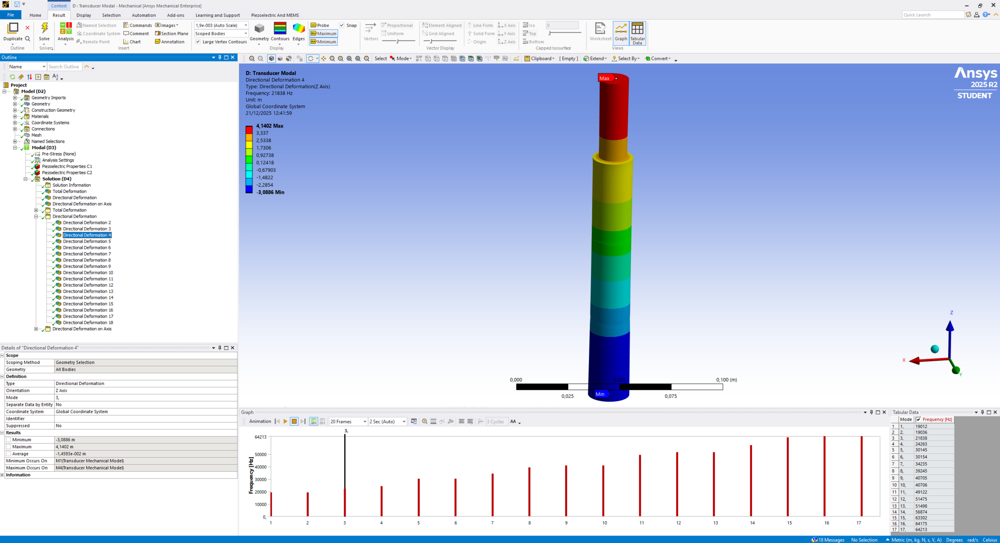
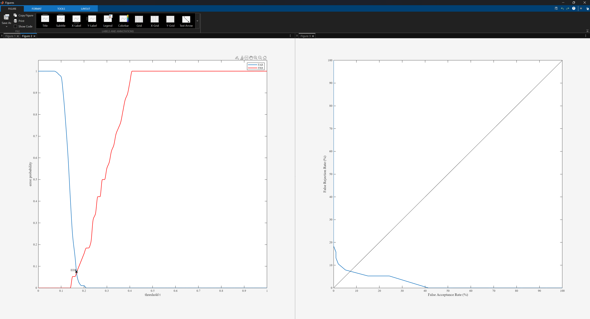

# Esercitazioni – Sensori, Rivelatori e Dispositivi Elettronici

Repository delle esercitazioni svolte per il corso di **Sensori, Rivelatori e Dispositivi Elettronici** (a.a. **2024–2025**), Università degli Studi della Basilicata – Laurea Magistrale in Ingegneria Informatica e delle Tecnologie dell’Informazione.

## Introduzione

Questo repository raccoglie le **tre esercitazioni** previste come prerequisito per lo svolgimento del progetto del corso.

Le esercitazioni coprono tre ambiti distinti:

- **Esercitazione A**: simulazione numerica di trasduttori piezoelettrici (MATLAB);
- **Esercitazione B**: simulazione FEM di trasduttori piezoelettrici (Ansys);
- **Esercitazione C**: analisi di caratteristiche biometriche (MATLAB).

Il repository è organizzato in **tre cartelle principali**, una per ciascuna esercitazione. All’interno di ogni cartella sono presenti le sottocartelle relative ai singoli esercizi.

Per tutte e tre le esercitazioni, come riferimento teorico di base è stato utilizzato il materiale fornito dal docente. Eventuali risorse aggiuntive consultate per integrare, correggere o completare gli esercizi (garantendo coerenza e significato fisico dei risultati) sono raccolte, per ciascuna esercitazione, nella relativa cartella `./res`.

## Note sul codice

Il codice è stato sviluppato privilegiando **leggibilità** e **modularità**. I risultati riportati sono stati verificati per quanto possibile dal punto di vista fisico e discussi con il docente. Le parti più articolate del codice sono commentate in maniera puntuale.

Il contenuto nelle cartelle `./external` è materiale fornito dal docente e/o sviluppato da terze parti: per questo motivo **non è garantita** né la correttezza né la qualità del codice in tali directory.

## Documentazione

È **fortemente consigliata** la lettura della relazione presente nella cartella `./doc` (nella root del repository). La relazione include:
- i concetti teorici necessari a inquadrare le esercitazioni;
- una discussione motivata delle principali scelte implementative adottate.

## Contributi

Il lavoro è stato svolto ponendo la massima attenzione sia sulla correttezza teorica che implementativa. Nonostante ciò, è possibile che siano presenti errori teorici o implementativi: in tal caso, segnalazioni e contributi (ad esempio tramite pull request) sono benvenuti.

## Galleria

**Esercitazione A — Simulazione numerica (MATLAB)**

**Esercitazione B — Simulazione FEM (Ansys)**

**Esercitazione C — Analisi biometrica (MATLAB)**

## License

Questo progetto è distribuito con licenza **MIT**. Per i dettagli, vedere [LICENSE.txt](./LICENSE.txt).
